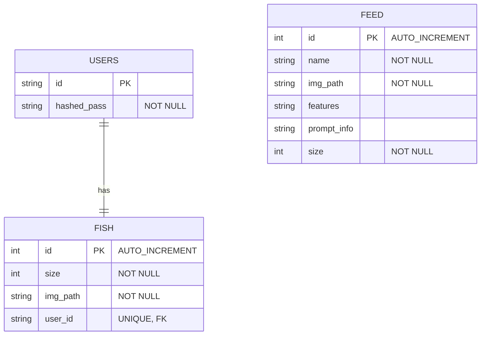

# ER図

```mermaid
erDiagram
    USERS {
        string id PK
        string hashed_pass "NOT NULL"
    }

    FISH {
        int id PK "AUTO_INCREMENT"
        int size "NOT NULL"
        string img_path "NOT NULL"
        string user_id "UNIQUE, FK"
    }

    FEED {
        int id PK "AUTO_INCREMENT"
        string name "NOT NULL"
        string img_path "NOT NULL"
        string features
        string prompt_info
        int size "NOT NULL"
    }

    USERS ||--|| FISH : "has"
```
### 備考
- FISH
  - size: 数値で大きさを表し、実際に鑑賞する際のサイズに反映
- FEED
  - features: 魚の餌画面で見れるその魚の特徴情報
  - prompt_info: 生成AIが成長させる際にプロンプトに入れる特徴情報
  - size: 数値で大きさを表し、捕食が可能かなどに利用できるかも
